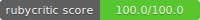

# README
* Welcome to Time-checker

# System dependencies
  1. Docker
  2. Docker Compose

# Start project
  docker-compose build

  docker-compose up

  docker-compose run web bundle exec rails webpacker:install

# Database creation
  
  docker-compose run web rake db:create

  docker-compose run web rake db:migrate

  <!-- docker ps

  docker exec -it container-id bash -->